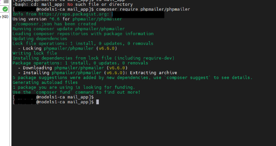

# Asistente virtual médico – MedicalBots

## Descripción
Este proyecto consiste en una plataforma web que busca ayudar y conectar a los usuarios con el cuidado de su salud a través de un modelo de asistencia inteligente brindando información acerca de temas relacionado con la salud.
## Características principales
La plataforma web ofrecerá al usuario:

- Recomendaciones de hábitos saludables y rutinas de ejercicios personalizadas.
- Un asistente virtual integrado con inteligencia artificial especializado en dar una consulta básica sin llegar a remplazar a un doctor real.
- Un apartado con información general sobre temas relacionados con el área de salud.
- Un calendario con información sobre jornadas médicas y ferias de salud.
- Un mapa con mecanismo de búsqueda interactiva especializado en la ubicación de unidades de salud más cercana.
## Tecnologías utilizadas
- **Fronted:** HTML5, CSS3, JavaScript.
- **Backend:** PHP 8.x.
- **Base de Datos:** MySQL 8.x.
- **Servidor Web:** Apache (XAMPP o LAMP).
- **IA:** Google Gemini API, Google Maps API.
## Instalación del proyecto
Descarga nuestro proyecto en

También puedes usar la línea de comando:

Vía Git

- Clonar el repositorio en tu maquina con el comando: git clone 

Instalación de programas para el funcionamiento del proyecto

1. Descarga la versión más reciente de PHP.
1. Descarga XAMPP (en el propio programa trae por defecto MySQL para la base de datos) para correr el proyecto de forma local.
1. Descarga Git para el control de sistemas de versiones. 

Instalación de dependencias

Descarga composer

**Instalador de Windows**

El instalador, que requiere que ya tenga PHP instalado, descargará Composer para usted y configurará su variable de entorno PATH para que pueda llamarlo simplemente composer desde cualquier directorio.

Descargue y ejecute [Composer-Setup.exe](https://getcomposer.org/Composer-Setup.exe "Haga clic aquí para descargar el instalador de Composer-Setup para Windows") : instalará la última versión de Composer cada vez que se ejecute.

**Instalación desde la línea de comandos**

Para instalar rápidamente Composer en el directorio actual, ejecute el siguiente script en su terminal. Para automatizar la instalación, consulte [la guía sobre la instalación programática de Composer](https://getcomposer.org/doc/faqs/how-to-install-composer-programmatically.md "Consulte las instrucciones sobre cómo instalar Composer mediante programación.") .

php -r "copiar('https://getcomposer.org/installer', 'composer-setup.php');"

php -r "si (archivo\_hash('sha384', 'composer-setup.php') === 'ed0feb545ba87161262f2d45a633e34f591ebb3381f2e0063c345ebea4d228dd0043083717770234ec00c5a9f9593792') { echo 'Instalador verificado'.PHP\_EOL; } de lo contrario { echo 'Instalador dañado'.PHP\_EOL; unlink('composer-setup.php'); salir(1); }"

php composer-setup.php

php -r "desvincular('composer-setup.php');"

Este script de instalación simplemente comprobará algunas php.iniconfiguraciones, le avisará si están configuradas incorrectamente y luego descargará la última versión composer.pharen el directorio actual. Las 4 líneas anteriores, en orden:

- Descargue el instalador en el directorio actual
- Verifique el instalador SHA-384, que también puede [comprobar aquí](https://composer.github.io/pubkeys.html "Obtenga la clave SHA-384 en GitHub (enlace externo)")
- Ejecute el instalador
- Eliminar el instalador

Lo más probable es que desees colocarlo composer.pharen un directorio en tu PATH, por lo que puedes simplemente llamar composerdesde cualquier directorio ( *instalación global* ), usando por ejemplo:

sudo mv composer.phar /usr/local/bin/composer

Para obtener más detalles, [consulte las instrucciones sobre cómo instalar Composer globalmente](https://getcomposer.org/doc/00-intro.md#globally) .

Instalación de PHPMailer

Asegúrate de haber instalado **Composer** y de que todavía estés conectado a través de SSH, como se explicó anteriormente.

1. Cree la carpeta deseada para PHPMailer:

mkdir mail\_app

2. Moverse al directorio de trabajo actual activo (CWD):

cd mail\_app

3. Instale PHPMailer con el comando Composer:

composer require phpmailer/phpmailer

4. Aquí está la salida de Composer para la instalación de php\_mailer:

5. Aquí no hay nada que recargar normalmente. Es en el [script](https://kb.n0c.com/en/glossaire/script/) donde debemos indicar la ruta a PHPMailer:

/home/user/mail\_app/vendor/phpmailer/phpmailer

instalar DomPDF con Composer

1. **Asegúrate de tener Composer instalado**: Descarga e instala Composer siguiendo las instrucciones para tu sistema operativo. 
1. **Abre tu terminal o consola**: Navega hasta la carpeta raíz de tu proyecto PHP. 
1. **Ejecuta el comando de instalación**: Escribe composer require dompdf/dompdf y presiona Enter. 

Código

`    `composer require dompdf/dompdf

1. **Verifica la instalación**: 

Composer instalará automáticamente el paquete DomPDF y todas las dependencias necesarias en la carpeta vendor de tu proyecto, además de generar el archivo autoload.php. 

1. **Incluye la librería en tu código**: 

En tu script PHP donde quieras usar DomPDF, agrega la siguiente línea para cargar los archivos necesarios:

Código

`    `require\_once 'vendor/autoload.php';
## Autores
- Ashly Nicole Rodríguez Paramo – Marketing.
- Ángel Isael Téllez Moraga – Desarrollador. 
- Carlos Eduardo Mercado Palacio – Diseño.
- Rothman Moisés Garibo Picado – Desarrollo.

Licencia MIT

([MedicalBots](https://github.com/medicalbots/medicalbots.git)) es un proyecto de código abierto que está licenciado bajo [MIT](http://opensource.org/licenses/MIT). Medicalbots se reserva el derecho de cambiar la licencia de futuras versiones.
## Información adicional
MedicalBots es un proyecto que esta en constante desarrollo que busca adaptarse o actualizarse a tecnologías actuales.
## Registro de cambio
Visita los [lanzamientos](https://github.com/medicalbots/medicalbots.git) para ver los registros de cambio.

